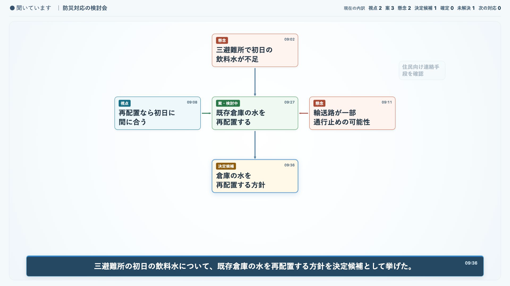
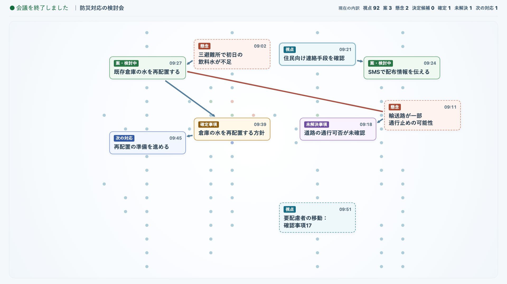

# RONRO / 論路

**議論の現在地を共有する。**



*RONRO CoreのSemantic Canvasを制御された合成会議で表示した例です。Spot実機の画面や、実会議におけるAIの関係付け精度を示すものではありません。*

論路（ろんろ / RONRO）は、会議中の議論を「論点図」として整理し、参加者が「今、何を議論しているか」「何が決まりつつあるか」「何がまだ残っているか」を共有するためのオープンソース・プロトタイプです。

会議後に読むAI議事録ではなく、会議中に見るための共有画面を目指しています。

このリポジトリは **RONRO Core / Research** の正本です。natadeCOCO Spot向けの製品Contentは別リポジトリの[natade-coco-ronro](https://github.com/hakobune8/natade-coco-ronro)で開発しています。CoreとContentの役割、現在の検証状況は[Spot Contentの現状](docs/architecture/spot-content-current-status.md)を参照してください。Spotへの移行は進行中ですが、このREADMEのローカル起動手順は従来の単独Webプロトタイプ用であり、Spot版の起動手順ではありません。

## 何を作っているか

会議では、複数の論点を行き来したり、以前の論点へ戻ったりします。論路は、一枚のSemantic Canvas上で今話している論点と近くのつながりを示します。話題が移れば見る範囲も移り、終了時には同じCanvasを引いて全体を見渡します。



*こちらもCoreの制御された合成会議の画面例です。Spot実機での表示確認を意味しません。*

- 今話していること
- 出てきた考えや選択肢
- 決定候補（自動確定ではありません）
- 未解決事項
- 次の対応
- これまでの話の流れ

参加者は共有画面を操作せず、必要なときに論点図を見て議論の現在地を確認します。AIの出力が正しいとは限らないため、最終的な判断は人が行います。

## 仕組み

```text
音声
  ↓
Speech-to-Text
  ↓
Discussion Analyzer
  ↓
Candidate Events
  ↓
Event Store / Materializer
  ↓
Discussion Graph
  ↓
論点図（Shared View）
```

下記の単独Webプロトタイプでは、ブラウザのAudioWorkletからバックエンドへ音声を送り、OpenAI Realtime transcriptionとAnalyzerを呼び出します。確定した発話だけがイベント・グラフ処理へ入り、共有画面へ反映されます。Spot版は同じCoreの意味契約を使い、GDK/Platformとの接続やスマホマイクを別リポジトリで実装します。

## Coreの単独Webプロトタイプで実装されているもの

- ブラウザのマイク入力とPCM変換
- ローカルWebSocketによる音声転送
- `gpt-transcribe` によるRealtime transcription（用語ヒント対応）
- Final Transcriptの正規化（Normalization v2）
- FIFO Queueと単一Analyzer Worker
- `gpt-5.6-luna` / `analyzer-prompt-v10-action-time-horizon` によるAnalyzer経路（Pilot候補設定）
- Semantic CanvasとAuto Cameraによる現在地周辺の表示、および終了時の全体表示
- 根拠がある場合の論点間のつながり、決定候補、未解決事項、次の対応の表示
- Human Commandによる進行役の修正・確認
- Session DrainとEvaluation Harness
- 1920×1080を対象とした読み取り専用の論点図共有画面

この一覧は単独Webプロトタイプのものです。**Spot版の実機受入れや機密会議への適合を示す一覧ではありません。** Spot版にはCloud-demo候補とPDF受取経路がありますが、実Providerと実機の検証が残っています。単独WebプロトタイプをProduction運用、複数ルーム、永続的な業務データ管理の実装済みサービスとは扱いません。

## Coreの単独Webプロトタイプをローカルで試す

### 必要なもの

- Python 3.12程度のPython環境
- マイクを利用できるブラウザ（Realtime Audioを試す場合）
- OpenAI API key

### 起動

```sh
python3 -m venv .venv
.venv/bin/pip install -r requirements-dev.txt
cp .env.example .env
# .env の OPENAI_API_KEY に自分のキーを設定する
.venv/bin/python -m prototype.server --host 127.0.0.1 --port 8000 --live-ws-port 8765
```

ブラウザで次を開きます。

- `http://127.0.0.1:8000/` — 参加者向け読み取り専用の論点図
- `http://127.0.0.1:8000/session` — 進行役向けスマートフォンController / Microphone
- `http://127.0.0.1:8000/control` — 開発・進行役向け画面
- `http://127.0.0.1:8000/shared` — `/`の互換入口

マイクは画面上で開始操作をした後にのみ使用されます。公開URLやHTTPS Ingressを使う場合の配備手順は[デプロイ手順](docs/deployment/kubernetes-pilot-deployment.md)を参照してください。

## テスト

```sh
.venv/bin/python -m unittest discover -v
```

テストでは、イベント検証、Materializer、Replay、Analyzer境界、音声・STTアダプター、Queue、Session Drain、Shared View、Evaluationを確認します。通常のテストから外部LLM APIは呼び出しません。

## ドキュメント

- [ドキュメント案内（現行資料と履歴資料）](docs/README.md)
- [Spot Contentとの役割分担と現在の検証状況](docs/architecture/spot-content-current-status.md)
- [RFC-0009: natadeCOCO Contentへの移行](docs/rfc/0009-ronro-as-natadecoco-local-ai-content.md)
- [MVP要件（改名前の名称を保持）](docs/requirements/discussion-map-ai-facilitator-mvp.md)
- [Architecture Summary](docs/architecture/mvp-architecture-summary.md)
- [論路のNaming Decision](docs/product/ronro-naming.md)
- ライブパイロットガイド：[画面で読む](docs/pilot/ronro-live-pilot-guide.md) / [配布用PDF](docs/pilot/ronro-live-pilot-guide.pdf)
- [Live Pilot Protocol](docs/evaluation/live-pilot-protocol.md)
- [Kubernetes配備手順](docs/deployment/kubernetes-pilot-deployment.md)
- [Public Release Readiness](docs/release/public-release-readiness.md)
- [Security Policy](SECURITY.md)

この公開リポジトリは `hakobune8/ronro` です。改名前のMVP要件、RFC、過去の評価資料には当時の作業名 `Discussion Map AI Facilitator` が残っています。履歴の追跡性を保つため、その記録を一括置換していません。現在の参加者向け名称は論路 / 論点図です。

## 制約とデータの扱い

以下の外部API・録音の説明は、このリポジトリの**単独Web Pilot**に適用されます。Spot ContentのCloud-demoにも外部Provider送信がありますが、Pilot録音の保存ルールをSpotへ流用しません。Spot版の現在の扱いは[別資料](docs/architecture/spot-content-current-status.md)を参照してください。

- AIの整理結果には誤りが含まれる可能性があります。
- 決定候補は自動的に確定されません。最終判断は人が行います。
- マイク音声はSpeech-to-Textと議論整理のため外部APIへ送信されます。
- パイロット環境では参加者全員の明示的な同意を開始条件として入力音声を評価用に保存し、評価担当者のみがアクセスでき、会議終了から7日後に自動削除します。本運用では音声を保存しない方針です。
- 機密性の高い会議で利用する場合は、データの送信先・保存設定・参加者への説明を事前に確認してください。

## 今後の候補

Pilotで得た知見をもとに、長時間会議での扱いとAnalyzerを改善します。Spot Contentは独立リポジトリで段階的に検証し、Local STT/Analyzerと機密会議向けネットワーク隔離は後続の課題とします。これらは現時点でProduction機能として約束するものではありません。

## Contributing

小さな修正や質問はIssue、変更提案はPull Requestで歓迎します。Canonical EventやArchitectureを変更する場合は、先に関連する要件・RFC・回帰テストを確認してください。詳しくは[CONTRIBUTING.md](CONTRIBUTING.md)を参照してください。

## License

このリポジトリのコードと文書は、個別の第三者ライセンス表示があるものを除き、[Apache License 2.0](LICENSE)の下で提供します。第三者依存ライブラリのライセンス条件も各配布物で確認してください。
