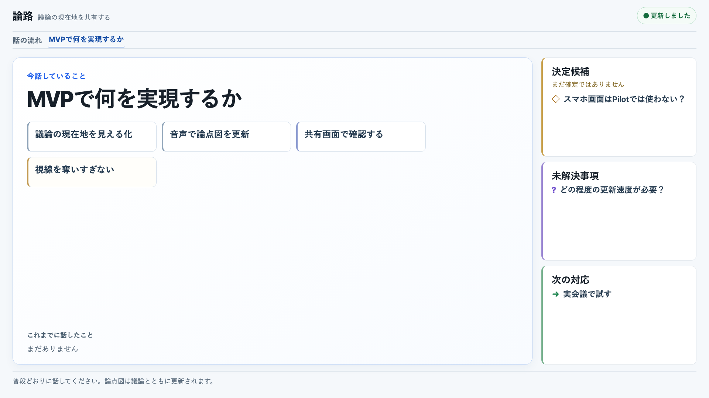
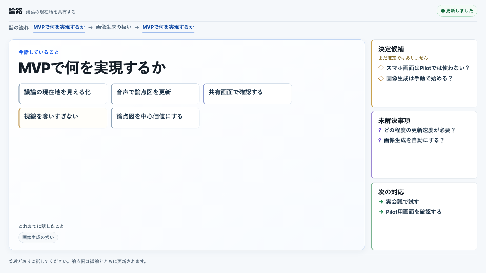
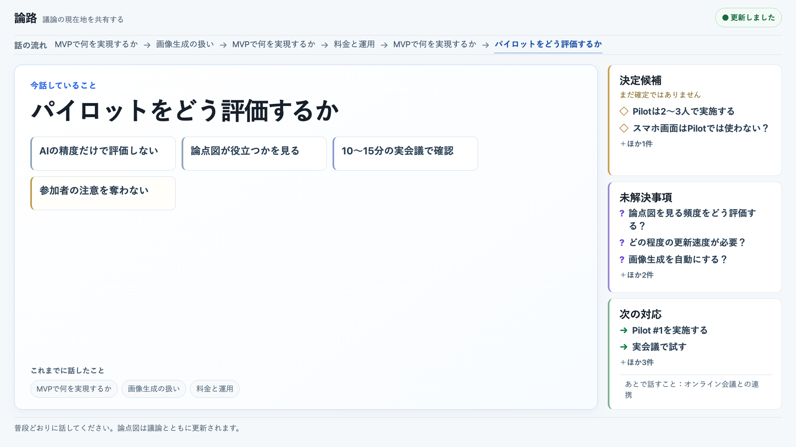

# 論路 Shared View 可読性レビュー

## 目的と判定対象

Live Pilot #1 の共有画面を、1920×1080・ブラウザズーム100%・会議室で3〜5m離れて見る前提で確認した。対象は、議論の内容を中心に見せる既存のShared Viewであり、レイアウト構成や議論の意味づけを作り直すものではない。

今回の判定基準は、5秒程度見たときに次の大枠が分かることとした。

- 今話していること
- 主要な内容
- 決定候補
- 未解決事項
- 次の対応
- 話の流れ

Canonical Graph、イベント、Analyzer、STT、Queue、Live Session、Human Command、評価指標、Kubernetes構成は変更していない。変更はShared Viewの表示サイズ、表示件数、余白、コントラスト、Demo Scenarioの短い表示文言に限定した。

## 最終調整

### 文字サイズ

| 要素 | 調整前の目安 | 最終値 | 方針 |
| --- | ---: | ---: | --- |
| 現在のトピックの見出し | 可変（最大約66px） | 60px固定 | 情報量に応じて縮小しない |
| 現在のトピックの主要内容 | 約21px | 24px | 1〜2行で読める短い内容を優先 |
| 決定候補・未解決事項・次の対応の見出し | 約22px | 26px | 内容より強くなりすぎない範囲で視認性を確保 |
| 決定候補・未解決事項・次の対応の内容 | 約18px | 22px | 3〜5mから主要項目を追える大きさ |
| 話の流れ | 約16px | 20px | Topic Returnを含む順序を追える大きさ |
| これまでに話したこと | 約16px | 18px | 弱く表示するが、読めないほど薄くしない |
| Runtime Status | 約16px | 18px | 内容の主役にならない小ささを維持 |
| フッター | 約16px | 18px | 参加者向けの短い案内を読める大きさ |

Shared Viewの主要な表示要素に18px未満の文字は置かない。情報が増えた場合も、文字を動的に縮小せず、表示内容を絞る。

### 情報量と表示予算

- 現在のトピックの主要内容は最大6件。
- 決定候補は最大2件、未解決事項は最大3件、次の対応は最大2件を優先表示。
- 超過分は `＋ほかN件` と控えめに示し、Canonical Stateは削除しない。
- 話の流れは直近の遷移を表示し、Stage 3ではTopic Returnを含む6項目を表示。
- 過去のトピックは短いチップとして弱く表示し、詳細カードで現在の内容を圧迫しない。
- 保留は内容がある場合だけ右側に表示する。

空白は欠陥ではなく、現在の議論を読みやすくするための余白として維持した。

### コントラストと階層

本文と補助文のコントラストを少し上げた。現在のトピックは抑えた青、決定候補は控えめなアンバー、未解決事項は紫系、次の対応は緑系とし、見出し・記号・文言でも区別できるようにした。画面全体を暗くしたり、色だけに意味を依存させたりしていない。

右側の3領域は白〜ニュートラル背景と細い色の左境界線を中心にし、現在のトピックより先に目へ入らないようにした。決定候補はチェックマークではなく `◇` を使い、未確定であることを保っている。

## 1920×1080 Stage Review

実Shared Viewを1920×1080で表示し、Demo ScenarioをCanonical Events → Graph → Projection → Shared Viewの経路で再生して取得した。

| Stage | 確認内容 | 判定 |
| --- | --- | --- |
| Stage 1 — 会議開始 | 現在のトピック、3つの主要内容、懸念、決定候補、未解決事項、次の対応 | PASS |
| Stage 2 — 議論中 | 現在のトピックを中心に、画像生成からMVPへ戻るTopic Returnと増えた内容 | PASS |
| Stage 3 — 議論が進んだ状態 | 最も情報量が多い状態。決定候補・未解決事項・次の対応の超過表示、過去Topic、話の流れ | PASS |

### Stage 1

現在のトピックが最初に目に入り、主要内容は短い1行の項目として読める。右側の情報は補助的で、数字や操作UIは表示されていない。

### Stage 2

現在のトピックを中心に、話の流れが「MVPで何を実現するか → 画像生成の扱い → MVPで何を実現するか」と戻る。Topic Returnを一覧の重複として消していない。

### Stage 3

最も情報量の多いケースでも現在のトピックの見出しは縮小せず、右側は各セクションの優先項目に絞っている。超過分は控えめな `＋ほかN件` として表示され、画面全体を埋めるための小さいカードは追加していない。

## 3〜5m想定の距離確認

各1920×1080画像を約35%（672×378）に縮小して確認した。細部の全文読解ではなく、どこを見るべきかという視覚的な優先順位を確認する方法である。

- 現在のトピックが最も大きく、中央左の主領域として認識できる。
- 右側に決定候補・未解決事項・次の対応がまとまっている。
- 上部の話の流れと下部の過去Topicが、現在の内容を邪魔せず履歴を示している。
- Runtime Status、フッター、境界線は補助的で、Discussion Contentより目立たない。

## Acceptance Checklist

| 確認項目 | Stage 1 | Stage 2 | Stage 3 |
| --- | :---: | :---: | :---: |
| 1. 3〜5mから現在のトピックを認識できる | Yes | Yes | Yes |
| 2. 主要内容を無理なく読める | Yes | Yes | Yes |
| 3. 決定候補を読める | Yes | Yes | Yes |
| 4. 未解決事項を読める | Yes | Yes | Yes |
| 5. 次の対応を読める | Yes | Yes | Yes |
| 6. 話の流れを追える | Yes | Yes | Yes |
| 7. 小さい文字を探す必要がない | Yes | Yes | Yes |
| 8. UIがDiscussionより目立っていない | Yes | Yes | Yes |

決定候補は確定済みに見えず、未解決事項と次の対応は内容が先に読める。Shared Viewにはボタン、リンク、入力欄、Hover依存の情報、Debug情報、Metric表示を置いていない。

## GuideとPDF

Pilot Guideの画像を最終Stage 1〜3へ更新した。Guide本文の参加者向け指示は、普段どおりに話し、ときどき論点図を見て議論の現在地を確認する内容に統一している。参加者自身の操作を前提にしていない。

PDFは日本語フォントで再生成し、全ページを画像化して、本文・キャプション・スクリーンショット・改ページ・縦横比・空白ページ・文字のはみ出しを確認する。PDFの詳細な生成結果は完了報告に記載する。

## 判定

Shared Viewは、1920×1080のPilot #1向けに、`pilot-001` のPresentationとしてFreezeした。以降、Pilot #1前にShared Viewの新機能や追加UIは入れない。今回の変更によるCanonical Contract変更、Analyzer/STT変更、Product Logic変更はない。

Live Pilot #1は本レビューの完了だけでは開始せず、既存のPilot開始手順に従って別途明示的に開始する。
