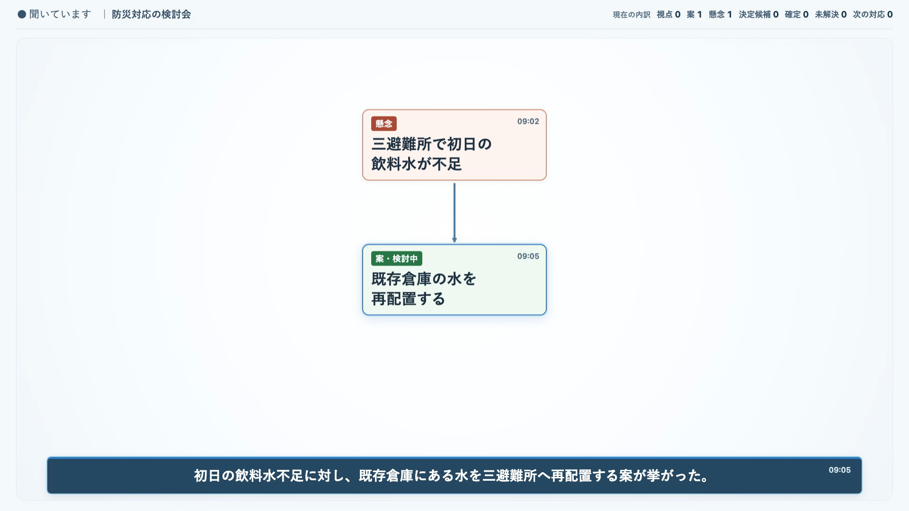
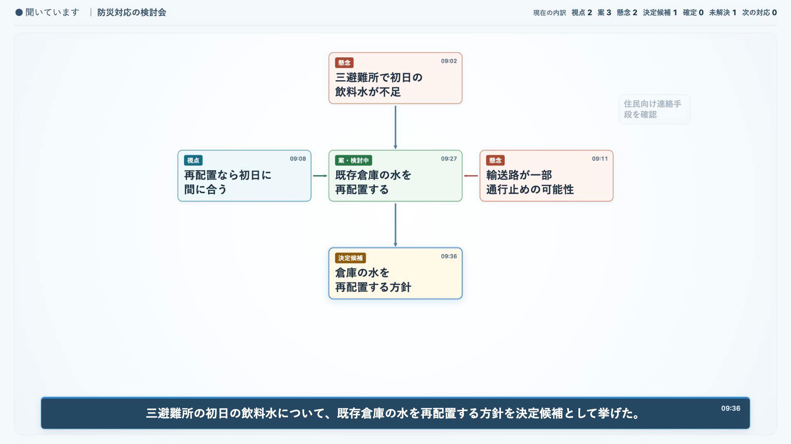
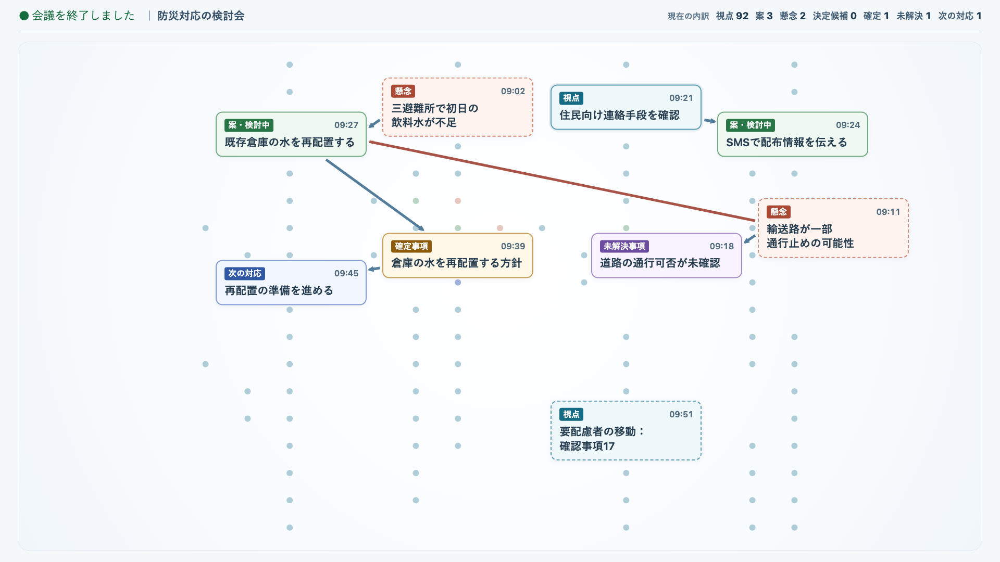

# 論路 ライブパイロットガイド

## 議論の流れと現在地を共有する「論点図」

ライブパイロットのご案内

会議の主役は参加者です。論路（ろんろ）は、話し合いの流れを見えるようにする補助役です。

---

## 論路とは

論路は、会議中に出てきた論点を整理し、参加者が議論の流れと現在地を共有するための試作システムです。**会議中に論点図を見ながら、今何を議論しているか、何が決まりつつあるか、何がまだ残っているかを共有する**ことを大切にします。発言を順番に要約するだけでなく、課題から案が生まれたり、話が枝分かれしたり、以前の論点へ戻ったりする道筋を捉えることを目指しています。

```text
話す → 論点図が更新される → ときどき見る → 必要なら指摘する → 話し続ける
```

> **論点図は完成済みの答えではありません。議論とともに、参加者と一緒に育てるものです。**

---

## 論点図の見かた

会議中は、今話している論点とその近くの話を中心に表示することを目指しています。画面から次のことを短時間で確認できるかを試します。

- 今、何について話しているか
- どの話を受けて今の論点が出てきたか
- どんな案や懸念が出ているか
- 何が決まりつつあり、何が残っているか

たとえば「課題から案が出る」「案に根拠や懸念が付く」「案を受けて決定候補が出る」といった動きを、ひとつの論点図の中で示します。今話している部分を中心に見せ、以前の論点は周辺に薄く残ります。**画面上で近いことや発言順だけで、論点同士に意味上の関係があるとは限りません。**確かめられないつながりは、無理に線で結びません。

### 画面は議論とともに育ちます

以下は、合成の会議例で作った共有画面です。実際の会議内容や、AIが常に正しくつなげられることを示すものではありません。



最初は課題と対応案など、確認できた少数の論点から始まります。青い枠が今の話の中心で、下部にはその論点の詳しい内容が表示されます。



議論が進むと、案を支える理由や懸念、決定候補も同じ図に加わります。**決定候補は、まだ確定していません。**未解決事項や次の対応も、出てきた場合はそれぞれの論点として示します。上部には種類ごとの件数が表示されます。



話題が移ったり前の論点へ戻ったりすると、見る範囲もその場所へ移ります。会議終了時は同じ図を引いて全体を示します。離れた論点をすべて小さな文字で読ませるのではなく、主なまとまりと決定・未解決・対応を見渡せる表示です。

これらは試作版の画面例です。表示方法や詳しい本文の見せ方は、検証によって変わる可能性があります。参加者が共有画面を操作する必要はありません。

---

## 違和感があれば、会話の中で伝えてください

AIの整理には誤りや確認できない部分がありえます。論点図は、その時点での仮の理解として見てください。

たとえば、次のように普段の言葉で指摘できます。

> 「その二つは別の話です」
> 「これはさっきの○○の話から出ました」
> 「その懸念は、こちらの案についてです」

指摘のために議論を長く止める必要はありません。はっきり特定できる訂正は発話から反映を試み、対象が曖昧なときは勝手につなぎ替えず確認します。進行役も操作画面から訂正できます。**発言だけで、どんな訂正も必ず自動修正されるわけではありません。**

---

## 決定候補・未解決事項・次の対応

論路は、通常の論点に加えて、決まりつつある内容、まだ答えが出ていないこと、議論を受けた次の対応も整理します。確認できたつながりは同じ論点図上に表示し、会議後にもどの議論から生まれたか振り返れる形を目指しています。

AIが示す**決定候補は確定した決定ではありません**。何を決めたか、誰が何をするかは、参加者と進行役が確認します。

---

## 会議が終わったあと

会議後には、どの論点から始まり、どこで枝分かれし、何が決まり、何が残ったかをたどれる記録を目指しています。現在はその形式を試作・評価中です。今回のパイロットで会議後の記録を提供するか、どの形式で共有するかは開始前に進行役が案内します。

---

## 今回のパイロットで確かめたいこと

- 議論の現在地や流れが分かるか
- つながりの表示が実際の議論に合っているか
- 話題が変わったり戻ったりしても追いやすいか
- 決定候補や未解決事項が役立つか
- 違和感を自然に伝えられるか
- 画面の更新が議論の邪魔にならないか
- 会議後の振り返りにも役立ちそうか

### 普段どおりに話してください

AI向けの特別な話し方は必要ありません。質問、意見、相槌、言い直し、話題の変更も含めて、いつものように話してください。必要なときに画面を見て、整理が意図と違えばその場で伝えてください。

### データの扱い

- マイクを使用し、発話を音声認識してAIが議論を整理します。
- パイロット期間中は、参加者全員が事前に同意した場合に限り、入力音声を評価用に録音します。目的は文字起こし・論点図の欠落や誤りを検証することです。
- 録音にアクセスできるのは評価担当者のみです。公開画面や参加者向けダウンロード機能には置かず、会議終了から7日後に自動削除します。本運用では音声を保存しない方針です。
- パイロット評価に必要な論点図、処理情報、観察メモ、感想などを保存します。
- 進行役は開始前に録音の目的・保存期間・閲覧できる人を説明し、参加者全員の明示的な同意を確認してから開始します。同意がそろわない場合、この録音必須のパイロットセッションは開始しません。
- 録音に欠落が起きても会議自体を自動終了しません。進行役に欠落を通知し、評価では録音を完全な証拠として扱いません。

不明な点は開始前に進行役へ確認してください。

---

**話す。見る。必要なら伝える。論路は、参加者と一緒に議論の道筋を育てます。**
