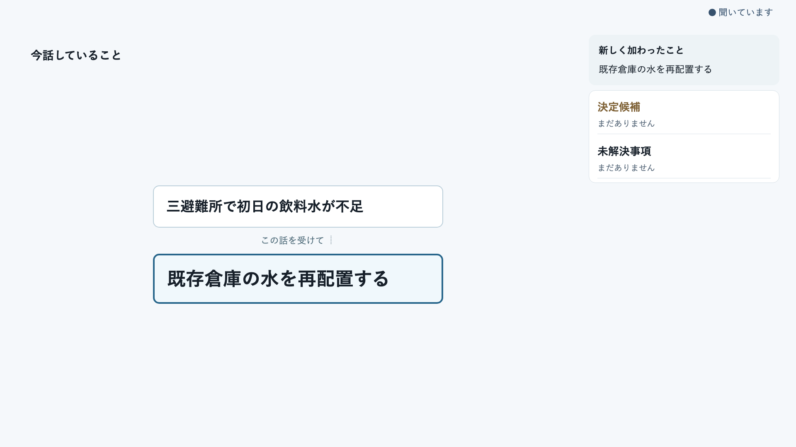
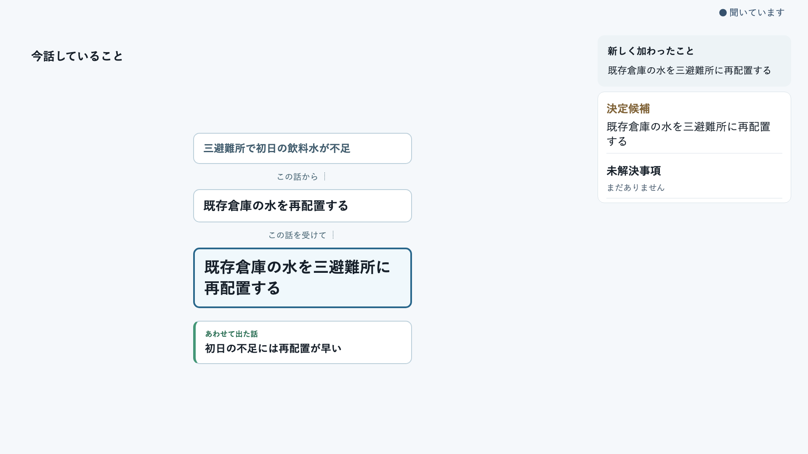
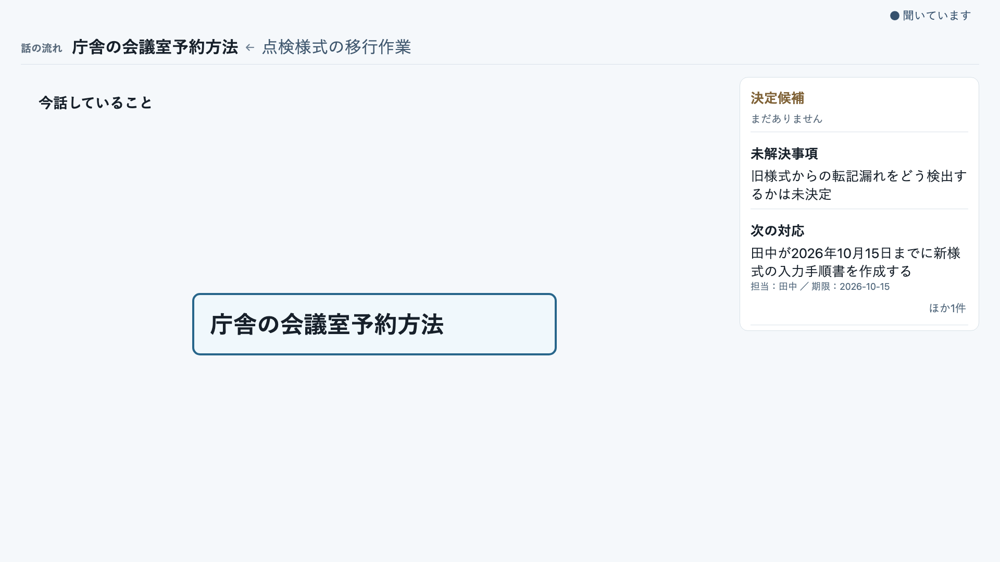

# 論路 ライブパイロットガイド

## 議論の流れと現在地を共有する「論点図」

ライブパイロットのご案内

会議の主役は参加者です。論路（ろんろ）は、話し合いの流れを見えるようにする補助役です。

---

## 論路とは

論路は、会議中に出てきた論点を整理し、参加者が議論の流れと現在地を共有するための試作システムです。**会議中に論点図を見ながら、今何を議論しているか、何が決まりつつあるか、何がまだ残っているかを共有する**ことを大切にします。発言を順番に要約するだけでなく、課題から案が生まれたり、話が枝分かれしたり、以前の論点へ戻ったりする道筋を捉えることを目指しています。

```text
話す → 論点図が更新される → ときどき見る → 必要なら指摘する → 話し続ける
```

> **論点図は完成済みの答えではありません。議論とともに、参加者と一緒に育てるものです。**

---

## 論点図の見かた

会議中は、今話している論点とその近くの話を中心に表示することを目指しています。画面から次のことを短時間で確認できるかを試します。

- 今、何について話しているか
- どの話を受けて今の論点が出てきたか
- どんな案や懸念が出ているか
- 何が決まりつつあり、何が残っているか

たとえば「課題 → 選択肢 → 懸念 → 決定候補」のような流れです。ただし、**画面上で近いことや発言順だけで、論点同士に意味上の関係があるとは限りません。**確かめられないつながりは、無理に線で結びません。別の話題は別の入口として扱うこともあります。

### 画面は議論とともに育ちます

以下は、制御された会議例を現在の候補画面に表示したものです。実際の会議内容や、AIが常に正しくつなげられることを示すものではありません。



最初は課題と対応案など、確認できた少数の論点から始まります。関係のない話を画面の空きに詰め込むことはしません。



議論が進むと、案を支える理由や決定候補も加わります。**決定候補は、まだ確定していません。**右側には、未解決事項や次の対応も必要に応じて残ります。



話題が移っても、上部の「話の流れ」に大きな移動や回帰を残します。現在の話題が左端です。中央はその時点で話している論点を示し、以前の話を無理につなぎません。

これらは開発中の画面例です。表示方法や詳しい本文の見せ方は、検証によって変わる可能性があります。参加者が共有画面を操作する必要はありません。

---

## 違和感があれば、会話の中で伝えてください

AIの整理には誤りや確認できない部分がありえます。論点図は、その時点での仮の理解として見てください。

たとえば、次のように普段の言葉で指摘できます。

> 「その二つは別の話です」
> 「これはさっきの○○の話から出ました」
> 「その懸念は、こちらの案についてです」

指摘のために議論を長く止める必要はありません。進行役が指摘を受け止め、試作画面で対応できる範囲を確認します。**発言だけで論点図が必ず自動修正される機能は、現在検証中です。**

---

## 決定候補・未解決事項・次の対応

論路は、通常の論点に加えて、決まりつつある内容、まだ答えが出ていないこと、議論を受けた次の対応も整理します。将来的には、それぞれがどの議論から生まれたかも振り返れるようにすることを目指しています。

AIが示す**決定候補は確定した決定ではありません**。何を決めたか、誰が何をするかは、参加者と進行役が確認します。

---

## 会議が終わったあと

会議後には、どの論点から始まり、どこで枝分かれし、何が決まり、何が残ったかをたどれる記録を目指しています。現在はその形式を試作・評価中です。今回のパイロットで会議後の記録を提供するか、どの形式で共有するかは開始前に進行役が案内します。

---

## 今回のパイロットで確かめたいこと

- 議論の現在地や流れが分かるか
- つながりの表示が実際の議論に合っているか
- 話題が変わったり戻ったりしても追いやすいか
- 決定候補や未解決事項が役立つか
- 違和感を自然に伝えられるか
- 画面の更新が議論の邪魔にならないか
- 会議後の振り返りにも役立ちそうか

### 普段どおりに話してください

AI向けの特別な話し方は必要ありません。質問、意見、相槌、言い直し、話題の変更も含めて、いつものように話してください。必要なときに画面を見て、整理が意図と違えばその場で伝えてください。

### データの扱い

- マイクを使用し、発話を音声認識してAIが議論を整理します。
- 録音データは、現在の方針ではデフォルトで永続保存しません。
- パイロット評価に必要な論点図、処理情報、観察メモ、感想などを保存します。
- 録音保存が必要な場合は、開始前に明示的な同意を確認します。

不明な点は開始前に進行役へ確認してください。

---

**話す。見る。必要なら伝える。論路は、参加者と一緒に議論の道筋を育てます。**
